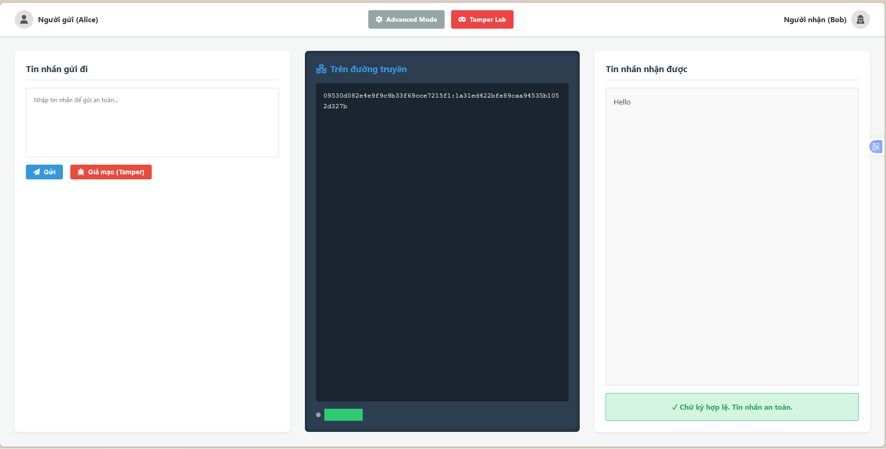
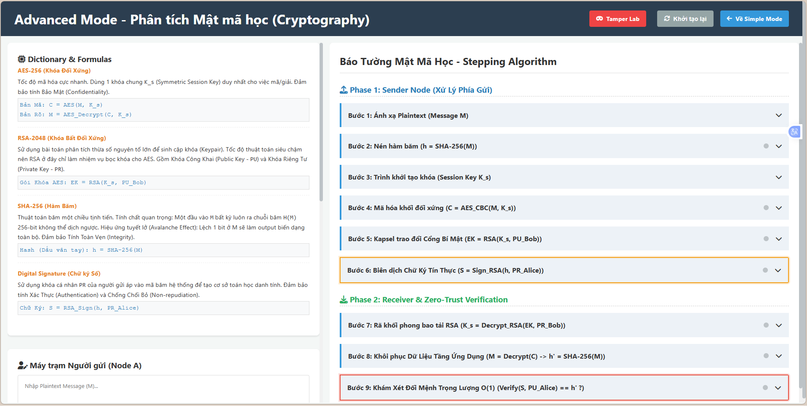
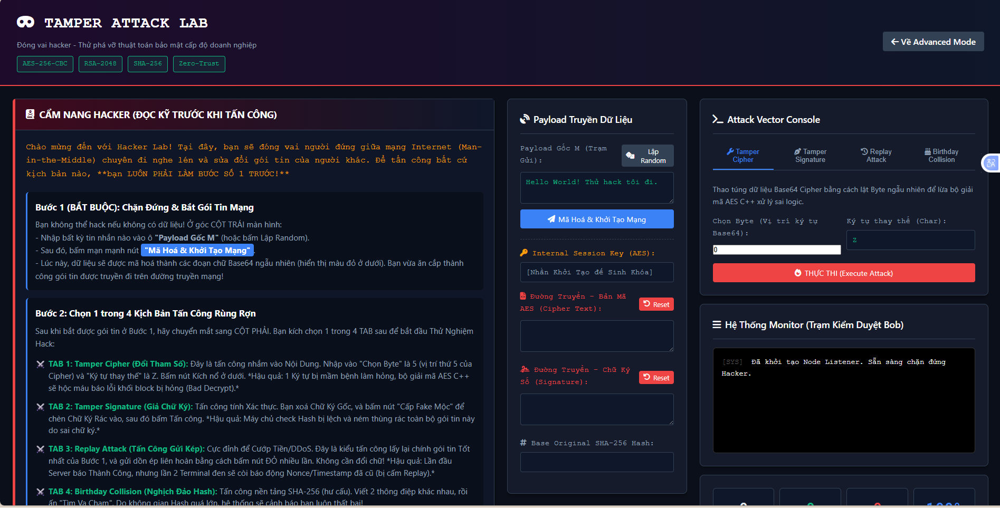

# E2E Encryption Demo 🔒
 

## Giới thiệu project
Dự án mô phỏng quá trình mã hóa đầu cuối (End-to-End Encryption) dùng trong phần lớn các ứng dụng chat bảo mật (như WhatsApp, Zalo, Signal). Hỗ trợ hiển thị trực quan dữ liệu đã bị mã hóa trên đường truyền (Wire), cũng như chia tách rõ ràng các bước thực hiện hệ mật khẩu AES, RSA và xử lý hàm băm SHA-256.

## Tính năng chính
- **Simple Mode**: Trải nghiệm gửi / nhận tin nhắn như người dùng cuối - mượt mà, nhanh gọn.
- **Advanced Mode**: Nhìn "xuyên thấu" các bước xử lý cụ thể theo step-by-step (quá trình tính toán Hash, tạo Key AES ngẫu nhiên mỗi phiên, mã hóa RSA key, tạo Signature chống giả mạo...).
- **Tính năng Tamper (Giả mạo)**: Nút giả lập cố tình gửi sai Cipher Text, hệ thống bắt lỗi nếu đường truyền bị tấn công man-in-the-middle thay đổi nội dung (sai Hash / Sign).

## Công nghệ sử dụng
- **Backend:** Node.js, Express, Core `crypto` module của Node để đảm bảo tốc độ Native.
- **Frontend:** HTML5, CSS3, Vanilla JS (Fetch API).
- **Mật mã:** AES-256-CBC, định dạng RSA-2048, SHA-256.

## Cài đặt và Khởi chạy

1. **Yêu cầu:** Hệ điều hành cài sẵn Node.js (phiên bản khuyến nghị >= 14.x)
2. **Cài đặt thư viện:**
   ```bash
   npm install express cors body-parser dotenv
   ```
3. **Tạo bộ RSA Keys mẫu (lưu dưới dạng vật lý):**
   ```bash
   node scripts/generate-keys.js
   ```
4. **Chạy server:**
   ```bash
   node backend/server.js
   ```
Server sẽ chạy tại: `http://localhost:3000/`. Trình duyệt của bạn sẽ tự động hiển thị chế độ Simple Mode.

## Cấu trúc project
```text
/backend
  /crypto      - Các class xử lý nền tảng mã hóa (aes.js, rsa.js, hash.js, signature.js)
  /keys        - Lưu giữ 2 bộ chứng chỉ RSA keys
  /routes      - API endpoints và Web Pages router
  server.js    - Root Application server
/frontend
  /css         - Style và Mobile Responsive
  /js          - Call API Fetch và UI Logic thao tác tương tác giao diện người dùng trơn tru
  index.html   - Cấu trúc giao diện simple mode
  advanced.html- Cấu trúc giao diện advanced mode chi tiết
/scripts
  generate-keys.js
/docs
  PRESENTATION.md
```

## Tóm tắt API
- `GET /api/keys`: Cung cấp public keys cho môi trường.
- `POST /api/send`: Giải quyết ở đầu người gửi - sinh AES Key, mã hóa Cipher Text, tạo lập chữ ký số.
- `POST /api/receive`: Nơi người nhận thao tác giải mã ngược lại, sau đó đối chiếu chữ ký có hợp lệ và vẹn toàn không.

## Demo Screenshots

### 1. Simple Mode
Trải nghiệm giao diện gửi / nhận tin nhắn cơ bản, người dùng không cần quan tâm đến các khái niệm mã hóa phức tạp.


### 2. Advanced Mode
Chế độ hiển thị chi tiết tiến trình mã hóa từng bước (tạo khóa AES, mã hóa RSA, Hash & Sign).


### 3. Tamper Attack Lab
Phòng thí nghiệm giả mạo tấn công đường truyền được tích hợp sẵn hướng dẫn tương tác (Interactive Tutorial), giúp hiểu rõ cách ứng dụng nhận diện và ngăn chặn giả mạo dữ liệu.


## License
MIT
